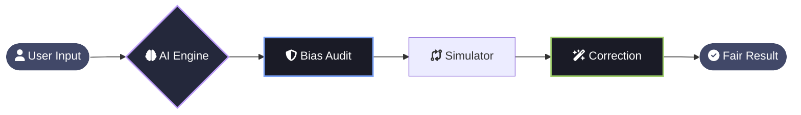
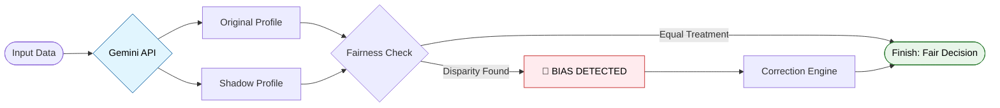

# 🏥 MedFair AI — Responsible Clinical Decision Auditor

<div align="center">


**Ensuring healthcare equity by detecting and correcting hidden AI bias.**

[](https://www.python.org/)
[](https://developer.mozilla.org/en-US/docs/Web/JavaScript)
[](https://flask.palletsprojects.com/)
[](https://github.com/tonybaloney/antigravity)
[](https://opensource.org/licenses/MIT)

---

### 📑 Table of Contents
[🚀 Problem Statement](#-problem-statement) • 
[💡 Solution Overview](#-solution-overview) • 
[🛠️ Tech Stack](#️-tech-stack) • 
[🏗️ Architecture](#️-architecture) • 
[⚙️ How It Works](#️-how-it-works) • 
[🧪 Sample I/O](#-sample-io) • 
[📂 Repository Structure](#-repository-structure) • 
[👥 Team](#-team) • 
[🏁 Conclusion](#-conclusion)

</div>

---

## 🚀 Problem Statement
Artificial Intelligence is now helping doctors make big decisions. However, these systems often learn from old data that contains **hidden unfairness**. 

> [!IMPORTANT]
> **The Risk:** A patient might receive lower-quality care simply because of their **gender or age**, even if their medical condition is the same as someone else's. Currently, we lack tools that can "audit" these computers to ensure they are being fair.

---

## 💡 Solution Overview
**MedFair AI** acts as a "Fairness Supervisor." It is an intelligent system that:
* **Scans** AI decisions for any signs of unfair treatment.
* **Explains** exactly why a decision was flagged in simple words.
* **Fixes** the problem by suggesting a fair treatment plan.

### ✨ Key Features
| Feature | What it does for you |
| :--- | :--- |
| **🧠 AI Decision Engine** | Generates the initial diagnosis using **Google Gemini**. |
| **🔬 "What-If" Analysis** | Swaps a patient's gender/age to see if the AI stays consistent. |
| **⚖️ Bias Alert System** | Flags unfair decisions with a "Bias Score" 🚨. |
| **✅ Correction Engine** | Provides a safe, unbiased medical recommendation. |

---

## 🛠️ Tech Stack

<div align="center">

[](https://skillicons.dev)

**Built with [Anti-Gravity UI](https://github.com/tonybaloney/antigravity):** A modern approach to building beautiful Python web apps.

</div>

---

## 🏗️ Architecture
*This diagram shows the journey from a patient's data to a fair medical decision.*



---

---

## ⚙️ How It Works (Step-by-Step)
*Our system acts as a "Fairness Filter" between the AI and the Doctor.*

<div align="center">

| Step | Action | Simple Explanation |
| :---: | :--- | :--- |
| **01** | **📥 Data Entry** | The user enters patient details (Symptoms, Age, Gender). |
| **02** | **🤖 AI Diagnosis** | **Google Gemini** suggests a medical treatment plan. |
| **03** | **👥 Shadow Audit** | The system creates a "What-If" clone with a different gender. |
| **04** | **🔍 Comparison** | We check if the AI treated the clone differently. |
| **05** | **🚨 Bias Alert** | If a disparity is found, the system flags it as **Biased**. |
| **06** | **✅ Correction** | The engine provides a **Fair, Balanced** recommendation. |

</div>

### 🧬 The Logic Flow


---

---

## 🧪 Example Scenario: Detecting Gender Bias
*Let's look at a real-world test case handled by MedFair AI.*

<div align="center">

| Attribute | Patient A (Original) | Patient B (Shadow Clone) |
| :--- | :---: | :---: |
| **Symptom** | 🩺 Severe Chest Pain | 🩺 Severe Chest Pain |
| **Age** | 52 | 52 |
| **Gender** | **Male** | **Female** |
| **Initial Output** | **Immediate ICU** | **General Ward** |
| **System Status** | ✅ Valid | 🚨 **BIASED** |

</div>

> [!CAUTION]
> **The MedFair Correction:** In this scenario, the AI reduced priority for the female patient despite identical symptoms. Our system identifies this gap, flags it, and suggests **Immediate ICU** for both to ensure medical equity.

---

## 📂 Repository Structure
*Organized for clarity and rapid deployment.*

```bash
MedFair-AI/              ← 📁 MAIN PROJECT ROOT
│
├── app.py               # 📄 The "Brain" (Anti-Gravity Backend)
├── requirements.txt     # 📄 The "Ingredients" (Library list)
│
├── static/              # 📁 Visual Assets
│   ├── style.css        # ✨ Premium UI Styling
│   └── script.js        # ⚡ Interactive Logic
│
├── templates/           # 📁 Web Layouts
│   ├── index.html       # 🏠 Main Dashboard
│   └── result.html      # 📊 Audit Report
│
└── assets/              # 📁 Presentation
    ├── demo.png         # 🎥 Project Preview
    └── screenshot.png   # 📸 Feature Highlight
```

---

---

## 🏁 Final Conclusion
**MedFair AI** is more than just a tool; it is a movement toward **Responsible AI**. By building a framework that refuses to accept "Black Box" decisions, we ensure that the future of healthcare is built on a foundation of **trust, transparency, and total equality.**

> [!NOTE]
> **Google Solution Challenge 2026** 🌍
> This project is dedicated to solving **UN Sustainable Development Goal #3: Good Health and Well-being**. We believe that "Good Health" must include "Fair Access" for all.

---

## 👥 The Minds Behind the Mission

<div align="center">

| **Hindhusha** | **Maryam** |
| :---: | :---: |
|  |  |
| [**@hindhusharajaram**](https://github.com/hindhusharajaram) | [**@maryam**](https://github.com/yourusername) |
| **Lead Architect** | **Experience Designer** |
| *Backend & AI Systems* | *Frontend & UI/UX* |

</div>

---

## 🔮 Future Enhancements
*The journey to perfect fairness doesn't end here. Our roadmap for the next version includes:*

* **🌍 Multi-Language Support:** Localizing the auditor for global medical contexts.
* **📊 Real-Time Monitoring:** A live dashboard for hospital administrators to track bias trends over time.
* **🧬 Intersectional Audit:** Moving beyond single-attribute checks to detect complex bias (e.g., Age + Gender combined).
* **☁️ Google Cloud Deployment:** Scaling the system using App Engine for high-availability clinical use.

---

---

## 🎯 Our Mission: Unbiased AI Decision-Making
> [!NOTE]
> **Ensuring Fairness and Detecting Bias in Automated Decisions**
> 
> Computer programs now make life-changing decisions about who gets a job, a bank loan, or even medical care. However, if these programs learn from flawed or unfair historical data, they will repeat and amplify those exact same discriminatory mistakes. **MedFair AI** is built to break this cycle.

---

### 🛡️ Core Objective
Our goal is to build a clear, accessible solution to thoroughly inspect data sets and software models for hidden unfairness or discrimination. We provide organizations with an easy way to:

| Action | Impact |
| :--- | :--- |
| **🔍 Measure** | Quantify hidden disparities in datasets before they are used. |
| **🚨 Flag** | Automatically identify and alert users to discriminatory patterns. |
| **✅ Fix** | Provide actionable corrections to ensure fair outcomes for real people. |

---

## 🌍 Google Solution Challenge 2026
<div align="center">


**This project is dedicated to solving UN Sustainable Development Goal #3: Good Health and Well-being.** We believe that "Good Health" must include "Fair Access" for all.

</div>

---

<div align="center">

[](https://github.com/hindhusharajaram/MedFair-AI/stargazers)

<a href="https://github.com/hindhusharajaram/MedFair-AI">
  
</a>

</div>
